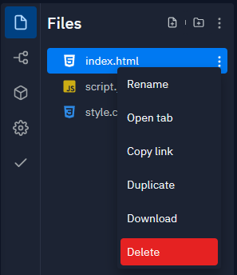

## Hosting your Unity Project

When your project is complete, you can share it with your others.

To share your project, you need to upload it to a web server. There are many ways of doing this, but one the simplest and easiest is to use [repl.it](https://replit.com/signup?from=landing).

Open repl.it in your web browser, and either sign in, or sign up for an account if you don't have one.

Create a new Repl by clicking the **Create Repl** button.

Choose to make an **HTML, CSS, JS** project, then give your project a name and click the **Create Repl** button.

Use the three dot menus to **Delete** all the files in the project.

You can now drag and drop all your build files into your repl.it project.

Click on the **Run** button and you should see your game running in the output window.

At the top of the output window, you will see a URL. This is the URL of your game, that you can then share with people.

  <iframe allowtransparency="true" width="500" height="400" src="https://sharegame.marcscott.repl.co/" frameborder="0"></iframe>

