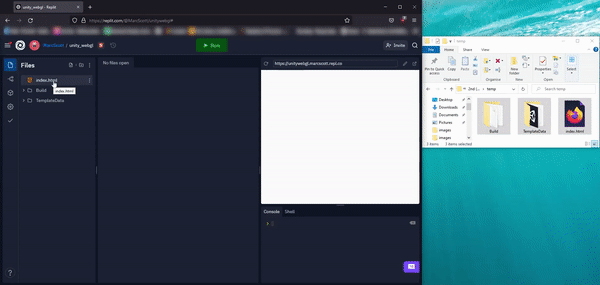

Lorsque ton projet est terminé, tu peux le partager avec les autres.

Pour partager ton projet, tu dois le télécharger sur un serveur Web. Il existe plusieurs façons de procéder, mais l'une des plus simples consiste à utiliser [replit](https://replit.com/signup?from=landing).

Ouvre [replit](https://replit.com/signup?from=landing) dans ton navigateur web, et connecte-toi, ou crée un compte si tu n'en as pas.

Crée un nouveau Repl en cliquant sur le bouton **Create Repl**.

Choisis de faire un projet **HTML, CSS, JS**, puis donne un nom à ton projet et clique sur le bouton **Create Repl**.

Utilise les menus à trois points pour **Supprimer** tous les fichiers du projet.

Tu peux maintenant faire glisser et déposer tous tes fichiers de build dans ton projet repl.it.

Clique sur le bouton **Run** et tu devrais voir ton jeu s'exécuter dans la fenêtre de sortie.

En haut de la fenêtre de sortie, tu verras une URL. Il s'agit de l'URL de ton jeu, que tu peux ensuite partager avec les autres.

  <iframe allowtransparency="true" width="500" height="400" src="https://sharegame.marcscott.repl.co/" frameborder="0"></iframe>

