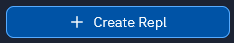
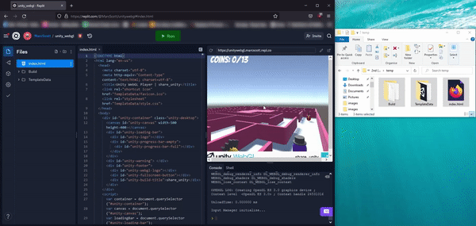

Wanneer je project voltooid is, kun je het met anderen delen.

Om jouw project te delen, moet je het uploaden naar een webserver. Er zijn veel manieren om dit te doen, maar een van de eenvoudigste en gemakkelijkste is om [replit](https://replit.com/signup?from=landing) te gebruiken.

Open [replit](https://replit.com/signup?from=landing) in je webbrowser, log in of meld je aan voor een account als je er nog geen hebt.

Maak een nieuwe Repl aan door op de **Create Repl** knop te klikken.

Kies om een **HTML, CSS, JS** project te maken, geef je project dan een naam en klik op de **Create Repl** knop.

Gebruik het menu met drie stippen om alle bestanden in het project te **Verwijderen**.

Je kunt nu al je build-bestanden naar je repl.it-project slepen en neerzetten.

Klik op de knop **Run** en je zou je spel in het output window moeten zien draaien.

Aan de bovenkant van het output window zie je een URL. Dit is de URL van je game, die je vervolgens met andere mensen kunt delen.

  <iframe allowtransparency="true" width="500" height="400" src="https://sharegame.marcscott.repl.co/" frameborder="0"></iframe>

